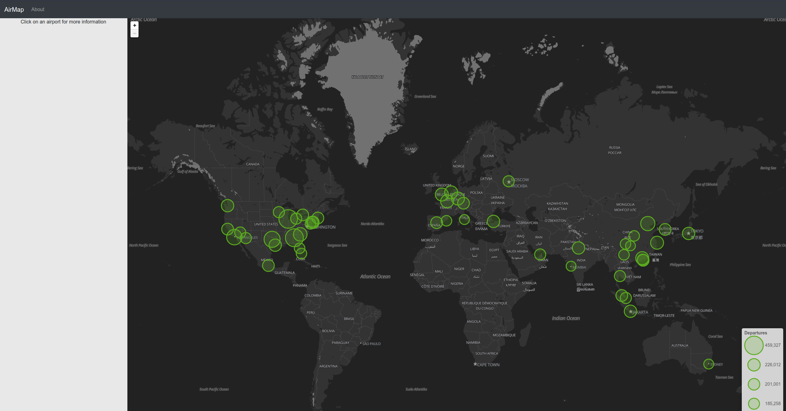
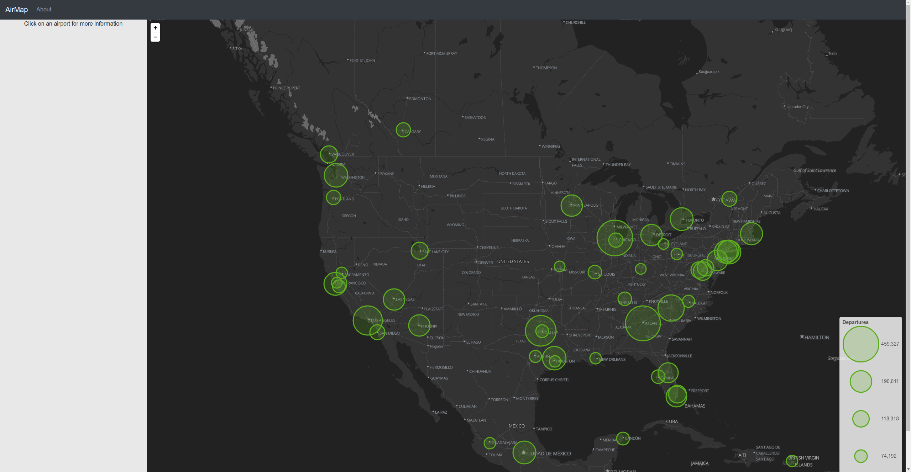
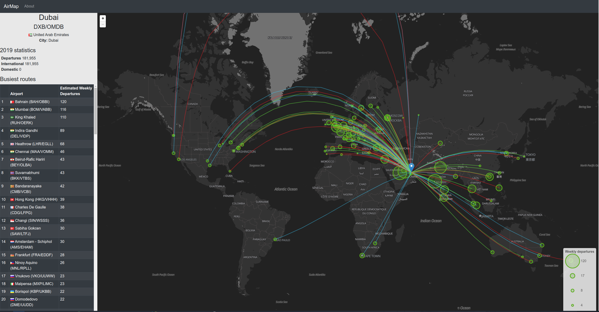
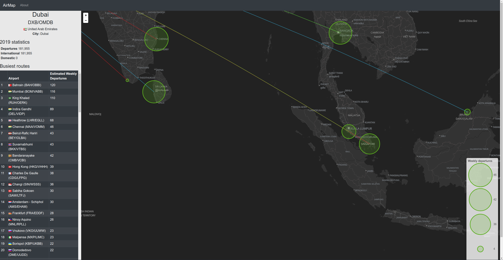

# AirMap
[Website](https://airmapp.herokuapp.com)

AirMap is a web application aimed at aviation enthusiasts that want to see the busiest airports from 2019 (by aircraft movements) on a world map.

This application has two modes: summary mode, and detailed mode. More details about these modes can be found on the application's About page.
## Technical stack

This web application was developed with React/Redux and Node.js. It is styled with React Bootstrap, and is powered by React Leaflet as its mapping tool.

Static airport data (total number of departures) was sourced from the ICAO iSTARS API, combined with mwgg's Airport Database for IATA codes and city information,  and stored in JSON format. 

Detailed data is fetched from OpenSky Network's REST API.
## Issues/Limitations
- This application is not responsive on mobile.
- Many major airports around the world do not have detailed departure data, due to gaps in the data source.
- The original plan was to show the most popular routes being scheduled in the past week, but I soon realised this would result in a lot of empty airports, due to the COVID-19 outbreak.
- Some CSS styling issues still exist. This will be worked out in the future.

## Future enhancements
- Allow user to select a custom date range to view detailed flights.
- Get HTTPS working on Heroku. I have no idea why I keep getting a "Mixed Content" error!

## Screenshots

## Sources and references
[ ICAO iSTARS API Data Service](https://www.icao.int/safety/iStars/Pages/API-Data-Service.aspx)

[OpenSky Network](https://opensky-network.org/)

[React Leaflet](https://react-leaflet.js.org/)

[Leaflet](https://leafletjs.com/)

[mwgg's Airports database](https://github.com/mwgg/Airports)
